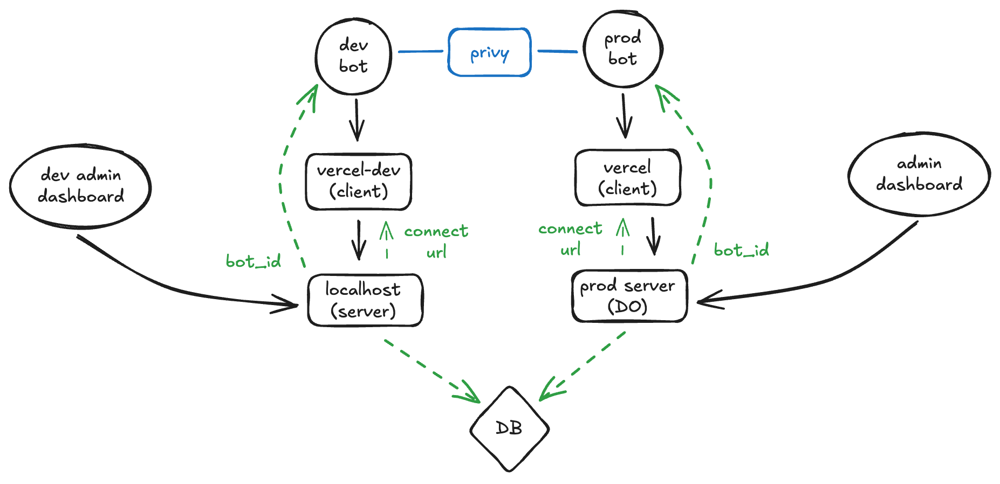
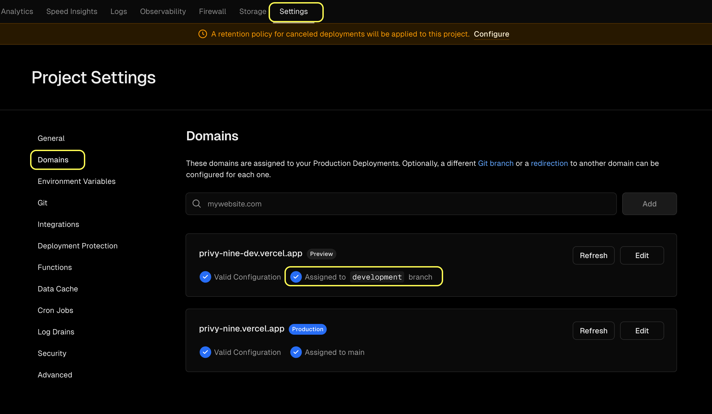
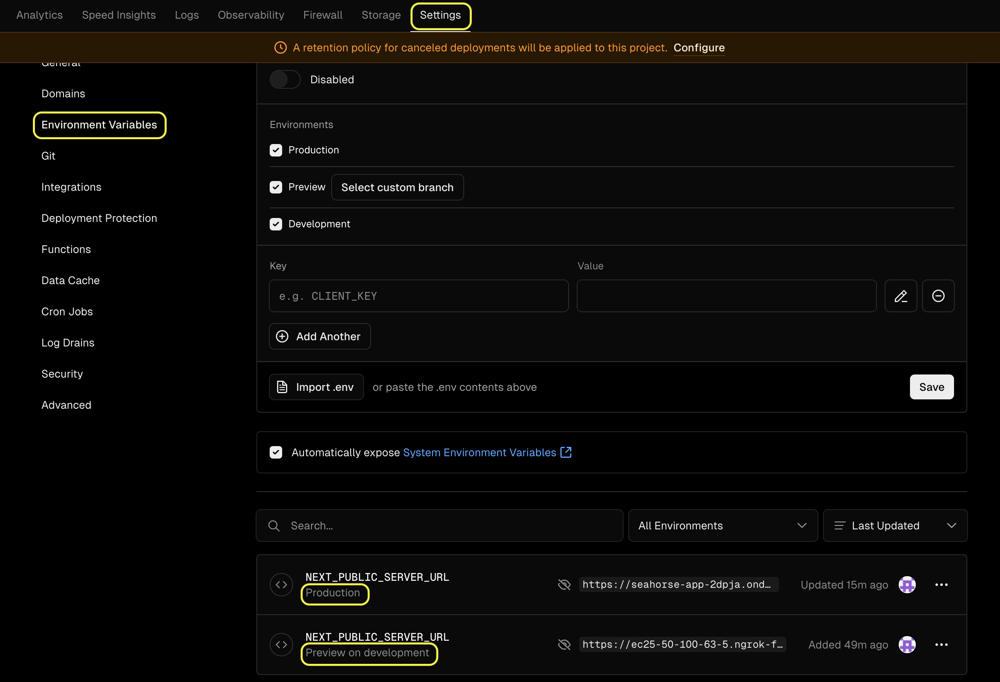

This is the clientside frontend for the seedclub telegram app. It is incharge of auth, and wallet connect logic that integrates privy, aswell as making backend calls to our system.

# Architecture

- currently in order to test on a localhost, we need a dev bot and a prod bot

  - the dev bot points to the local host via dev vercel deployment
  - the dev server then uses the dev bot id to communicate back with the dev bot

- Improvements for future
  - local db
  - local privy instance

# Guides

## Bot Deployment

- Use bot father on telegram to setup the bot
- to register the bot endpoint (webhook) use get request to register the bot:

  `https://api.telegram.org/bot{api_token}/setWebhook?url{url}`

  for example: `https://api.telegram.org/bot7497657938:AAHKJA-1TkQWCXORh3j75IWMjN2m72xz0pI/setWebhook?url=https://ec25-50-100-63-5.ngrok-free.app/telegram-webhook`

- this will trigger the /telegram-webhook endpoint on every bot message from the user

## Client Side Bot Setup

- have two domain setup in vercel one pointing to preview branch (i.e development)

- have `NEXT_PUBLIC_SERVER_URL` setup for both prod and development (if needed)
  - the NEXT_PUBLIC_SERVER_URL points to our server, its meant to be called when a new user signs up

- in this example the development is pointed to my localhost (via ngrok) and production is pointed to our production url

## Admin Dashboard

- the admin dashboard also uses the env variable `NEXT_PUBLIC_SERVER_URL` in vercel, so you can follow the same guide as above
- since it doesn't require telegram, dev testing can be done locally without deployment to vercel
- just create a `.env.local` file in the root directory with `NEXT_PUBLIC_SERVER_URL=http://localhost:3005` (adding your local url)

### Server

The server needs to send either the development vercel or the prod vercel link, the dev vercel domain (from above) will point to the local host (ngrok) and can make development easier, while the prod one just points to the server deployment of the backend

1. update cors configuration `app.use(cors({ origin: ['https://privy-nine.vercel.app', 'https://seed-club-dashboard.vercel.app', 'http://localhost:3000'], credentials: true }));
`

- in the current implmentation of privy we need to forward the cookies.

2. look at example.env to see the .env variables needed, then create a .env file with those values. We are using dotenv to load env varaibles inside config.js
